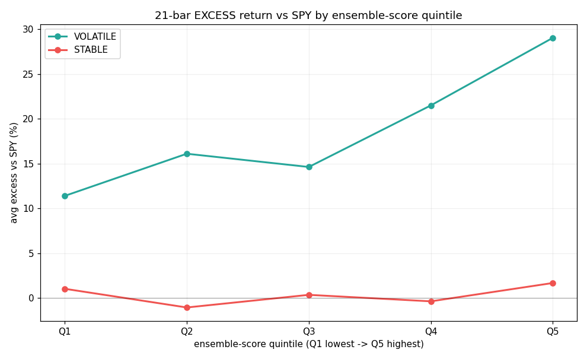
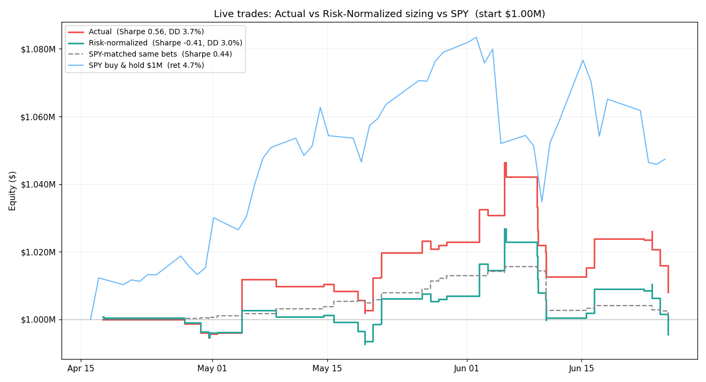
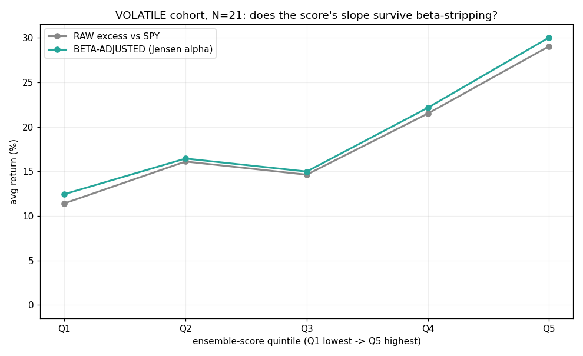
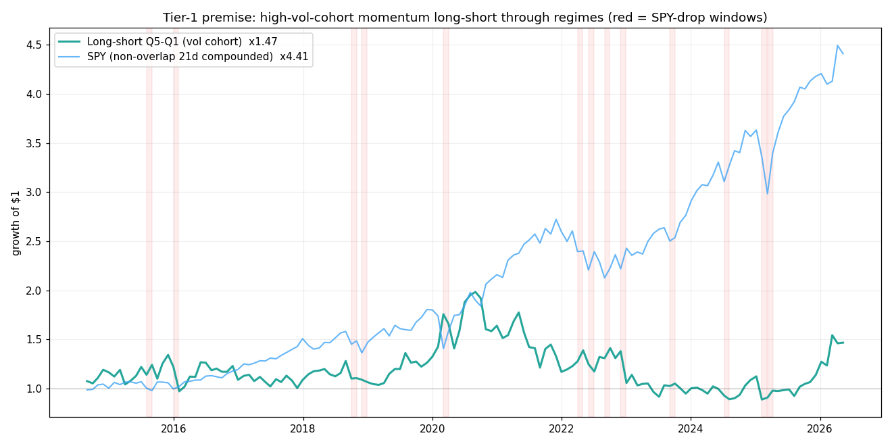

# Volatility-cohort edge — the system's signal works only on high-ATR names, at a monthly horizon, on a regime-beta pedestal

## Status

**observed** (2026-06-26) · **hypothesized** (2026-06-26) · **tested** (2026-06-26)

Analysis scripts (read-only, re-runnable):
- `scripts/analyze_volatility_cohorts.py` — live + WF cohort characterization (table)
- `scripts/analyze_score_forward_returns.py` — forward-return IC + portfolio sort (chart)
- `scripts/analyze_sizing_counterfactual.py` — risk-sizing counterfactual (chart)
- `scripts/analyze_score_beta_decomposition.py` — H1-vs-H2 beta-decomposition (chart)
- `scripts/analyze_premise_regime.py` — Tier-1 out-of-regime premise check, 2014- (chart; yfinance, proxy)

---

## Observation

The paper account is roughly flat after ~2.5 months (NLV ≈ +2.7%, realized P&L +$8,016 over 62 live round trips, win rate 43.5%). Decomposing *where* the P&L comes from surfaced one pattern that replicates across four independent cuts: **predictive content is concentrated almost entirely in high-volatility names, at a ~monthly horizon, and is sitting on a large bull-regime beta tailwind.**

Cohort split is by per-symbol characteristic volatility = mean(`atr_14`/`close`) over 1d bars; median across traded symbols = **2.79%/day** is the VOLATILE/STABLE threshold.

**1. Live trades (62), by cohort** (`analyze_volatility_cohorts.py`):

| Cohort | N | Win rate | Avg win | Avg loss | Mean ret | Profit factor | $ P&L |
|---|---|---|---|---|---|---|---|
| VOLATILE | 32 | 43.8% | **+13.6%** | −7.4% | **+1.80%** | **1.44** | **+$22,717** |
| STABLE | 30 | 43.3% | +3.2% | −4.6% | −1.20% | 0.54 | −$14,701 |

Win rates are identical; the edge is entirely in **win magnitude** (volatile winners ~4× bigger). In dollar terms the live volatile edge is tail-driven: removing the top 4 winners (AXTI, SNDK, MRVL, ASTS) flips the volatile cohort to **−$22,346**.

**2. Walk-forward (612 deduped trades, 211 symbols)** — independent, larger sample, same pattern, stronger:

| Cohort | N | Win rate | Avg win | Avg loss | Mean ret | Median | Profit factor |
|---|---|---|---|---|---|---|---|
| VOLATILE | 303 | 59.1% | +13.1% | −7.9% | **+4.48%** | +3.02% | **2.38** |
| STABLE | 309 | 50.2% | +4.3% | −4.4% | −0.06% | +0.04% | 0.97 |

(Excluding 0-day `fold_end` artifacts: VOLATILE +4.80% / n=286, STABLE −0.06% / n=299. WF magnitude is inflated by `fold_end` left-truncation — see CLAUDE.md — so treat it as directional, not as expected return.)

**3. Forward-return IC** — bias-free (point-in-time `signal_log` scores vs subsequent realized returns; no bracket simulator) (`analyze_score_forward_returns.py`):

| Horizon | Cohort | n | IC (ensemble) | IC (LSTM) | dir-hit |
|---|---|---|---|---|---|
| N=5 | VOLATILE | 777 | −0.02 | +0.03 | 0.52 |
| N=5 | STABLE | 911 | +0.05 | +0.02 | 0.48 |
| **N=21** | **VOLATILE** | 191 | **+0.18** | **+0.24** | **0.63** |
| N=21 | STABLE | 342 | +0.03 | −0.02 | 0.47 |

The score has **no 1-week predictive power** anywhere; at **1 month** it ranks volatile-name returns with IC 0.18 / 63% directional hit. LSTM carries it; FinBERT IC is ~0 throughout (consistent with its +0.01 near-weightless component).

**4. Portfolio sort — excess vs SPY by score quintile, N=21** (`analyze_score_forward_returns.py`):

| Cohort | baseline excess | Q1 | Q5 | Q5−Q1 | score-add (Q5−baseline) |
|---|---|---|---|---|---|
| VOLATILE | **+18.5%** | +11.4% | +29.0% | **+17.6%** | +10.5% |
| STABLE | +0.3% | +1.0% | +1.7% | +0.6% | +1.3% |

The volatile line rises monotonically; the stable line is flat near zero. **But the dominant number is the +18.5% pedestal** — even the *worst-scored* volatile names beat SPY by +11% — which is leveraged beta in a bull tape, not signal. "Excess vs SPY" removes market *level* but not beta *amplification*. The score-attributable part is the **slope** (Q5−Q1 = +17.6%), which a long/short cancels most of the shared beta out of.

**5. Sizing is NOT the lever** (`analyze_sizing_counterfactual.py`):

Re-sizing every live trade to fixed-fractional risk (equal dollar-risk-to-stop) turns +$8,016 actual into **−$4,431** (and −$2,842 under a notional-matched variant). It halves the worst loss and smooths the curve but loses money, because the wide-stop volatile names that the normalization shrinks are exactly the cohort carrying the profit. The lumpy sizing is a feature of a positive-skew momentum book, not a bug.

**6. Beta-decomposition — the slope is alpha; the pedestal is thematic, not CAPM beta** (`analyze_score_beta_decomposition.py`, 2026-06-26):

Cohort betas: VOLATILE 2.00, STABLE 0.74. Stripping CAPM beta (Jensen alpha = `r_stock − β·r_spy` instead of `r_stock − r_spy`) on the N=21 volatile cohort:

| | Q1 | Q5 | Q5−Q1 | survival |
|---|---|---|---|---|
| raw excess vs SPY | +11.4% | +29.0% | +17.64% | — |
| beta-adjusted (Jensen α) | +12.4% | +30.0% | +17.59% | **100%** |

The two lines are nearly coincident. **The score's selection slope is genuine, beta-independent alpha**: `corr(score, β) = +0.09`, beta is flat across score quintiles (all ~2.0), and OLS `raw_xs ~ 1 + β + score` gives a positive score coefficient (+0.117) holding beta fixed. But the **pedestal also survives beta-adjustment** (Q1 Jensen α still +12.4%) — so it is **not** CAPM market beta (SPY only did ~+1.7%/21d here); it is idiosyncratic *thematic/cohort momentum* (quantum/space/crypto names running on their own narratives). The consequence is sharper than "it's beta": a CAPM-beta hedge would **not** neutralize the pedestal — only cohort/theme-neutral construction (long high-score / short low-score *within* the volatile cohort) cancels it. STABLE cohort shows no score selection (Q5−Q1 +0.6%, OLS score coef −0.017; its score↔β corr is +0.31).

**7. Out-of-regime premise check (Tier 1) — the edge inverts in bear markets** (`analyze_premise_regime.py`, 2026-06-26):

Since the live sample has zero bear data, this substitutes history: the edge reconstructed as a pure price factor (point-in-time top-40%-volatility cohort, trailing-6m-momentum quintiles, non-overlapping 21d holds) over 2014→present, 125 long-history liquid names, split by regime. **PROXY** for the LSTM (momentum, not the model) and **survivorship-biased** (yfinance has no delisted names — so stress numbers are optimistic).

| Regime | n | SPY fwd | Cohort excess (pedestal) | Q5−Q1 slope | slope +ve |
|---|---|---|---|---|---|
| Normal | 128 | +2.1% | +1.10% | +0.94% | 58% |
| **Stress** (SPY 21d < −5%) | 13 | −8.2% | **−3.28%** | **−2.76%** | 31% |

In market-drop windows **both** components invert: the high-vol pedestal goes negative (the cohort falls *harder* than SPY) and the momentum slope goes negative (a classic momentum crash — high-momentum names underperform low). The 12-year long-short compounds to just **1.47×** (vs SPY 4.41×), and that 1.47× is concentrated in two momentum booms (2020, 2025–26) with a multi-year bleed 2021–2024 in between. The 2026 slope (+5.78%/21d) is the **highest of any year in the sample** — the live finding was measured in this factor's best regime in a decade; the normal-regime slope is ~+0.9%/21d (≈1/18th the live +17.6%). This is the profile of a **known, crowded, pro-cyclical risk premium with crash risk — not durable alpha.**

---

## Sample / dataset

- **Window**: 2026-04-10 → 2026-06-26 (~2.5 months). `db/trading.db`.
- **Live**: 62 `source='live'` `trade_log` round trips. **WF**: 612 deduped (latest run_id per symbol) of 2,824 `source='walk_forward'` rows across 211 symbols. **Scores**: 2,536 `signal_log` rows, 190 symbols; ~1,688 have an N=5 forward window, ~533 have N=21.
- **Regime caveat (load-bearing)**: the entire window is one sustained rally in high-beta names. There is **zero correction/bear data** in the sample (the 2026-06-10 portfolio CB-flatten is the only down-event). Every absolute number here is fair-weather.
- **Overlapping windows**: the N=21 IC/sort use overlapping 21-day holds across correlated names in the same weeks, so effective independent N is far below the nominal n — nominal significance overstates.

---

## Hypotheses (ranked)

**H1 — The score carries genuine cross-sectional selection alpha within volatile names.** The Q5−Q1 slope (+17.6% at N=21) and the +0.18 IC are real ranking information that survives beta-neutralization. If H1 holds, a beta-hedged long-Q5/short-Q1 volatile book keeps a positive spread, and the slope persists out-of-regime. Falsifiable by the beta-decomposition test below. **— Beta-decomposition run 2026-06-26 SUPPORTS H1 for the in-sample slope (100% survival of Q5−Q1 after stripping CAPM beta; beta flat across quintiles; OLS score coef +0.117). The out-of-regime half of H1 is still open.**

**H2 — The apparent edge is mostly regime beta.** Volatile names beat SPY because they are high-beta in a bull tape; the score correlates with beta, so higher-scored names simply have more beta. If H2 holds, the +18.5% pedestal and much of the slope invert in a correction, and the slope shrinks toward zero after beta-neutralization. This is the null that H1 must clear; the +18.5% pedestal is already strong prima facie evidence for it.

**H3 — The signal is horizon-mismatched to execution.** Predictive at N=21, ~0 at N=5, but live trades hold ~8–10 days and stop out fast — so the system exits inside the dead zone, before the edge realizes. If H3 holds, longer-held live trades show higher realized excess than shorter-held ones. Falsifiable on the live book as it grows.

---

## Discriminating tests

- **H1 vs H2 — beta-decomposition** (next analytical step, do-able now): regress per-event 21-bar excess on each symbol's SPY beta; report the Q5−Q1 slope *after* residualizing on beta. If the residual slope stays large and positive → H1; if it collapses → H2. Pairs with isolating the sample's few down-weeks (incl. 2026-06-10) and checking whether the quintile ordering inverts.
- **H1/H2 — out-of-regime re-run** (the binding gate): re-run all three scripts after the first ≥5–8% SPY drawdown. The volatile-cohort edge surviving a correction is the only thing that distinguishes alpha from leveraged beta.
- **H3 — holding-period split**: bucket live trades by realized holding days, compare mean excess; or paper-test a 21-day-hold variant of the top-quintile-volatile strategy.

---

## What we are NOT doing yet, and why

- **Not switching to risk-normalized sizing.** Tested and rejected (§5): it loses money on this book. The wide stops let volatile winners run; tightening/normalizing amputates the working cohort.
- **Not narrowing the universe to volatile names yet.** The edge is beta-contaminated and single-regime. Acting now would convert the book into an un-hedged leveraged bull bet dressed up as a signal. The prune-the-stable-cohort half (the −$14.7k dead weight) is lower-risk but still waits on the beta-decomposition to confirm the stable cohort isn't just unlucky.
- **Not lengthening the production holding period.** H3 is untested on realized P&L; the WF/IC evidence is suggestive but the live book hasn't isolated it.
- **Not wiring anything into `signal_runner`.** All four analyses are read-only research on a 2.5-month bull sample. No parameter or universe change is justified before the out-of-regime gate fires.

---

## Trigger to revisit / verification gate

- **The first ≥5–8% SPY drawdown** — re-run all scripts and append the verdict. ~~This is THE gate.~~ **Partially pre-empted 2026-06-26** by the Tier-1 historical proxy (Observation §7), which found the edge *inverts* in stress windows. A live drawdown is now a confirmation, not the first read — and the remaining faithful test is Tier 2 (LSTM-only walk-forward over 2014–, point-in-time cohort) to check whether the actual model behaves better than the momentum proxy through bears. Default expectation: it does not (price-pattern model).
- **Beta-decomposition (H1 vs H2)** — do-able now; the cheapest next step and the one most likely to move the finding from `tested` toward `resolved`.
- **≥2 more months of live trades** — for non-overlapping N=21 windows and a meaningfully larger volatile-cohort n (currently 32 live).
- **Phase B realised P&L by holding period** — once enough live rows exist, test H3 against actual outcomes.

Escalation once tests run: H1 supported through a drawdown → CLAUDE.md *Enhancements* entry proposing a volatility-tilted universe + beta-aware construction + ~monthly holding. H2 supported → retire the "narrow to volatile" ambition; the cohort number was leveraged beta, and the honest conclusion is the system has no regime-robust selection edge.

---

## Status log

**2026-06-26** — Observed + tested in one session. Triggered by the account being ~flat after 2.5 months. Built four read-only analyses: (1) live + WF cohort characterization, (2) forward-return IC, (3) excess-vs-SPY portfolio sort, (4) risk-sizing counterfactual. Findings: predictive content concentrates in high-ATR names at a ~monthly horizon (N=21 IC 0.18 / 63% dir-hit volatile; N=5 ≈ 0 everywhere), LSTM-carried, FinBERT-dead; the live cohort edge is tail-driven (top-4 winners) and the portfolio-sort edge sits on a +18.5% beta pedestal that is almost certainly regime, not skill; risk-normalized sizing was tested and rejected (loses money — the wide-stop volatile names carry the profit). Three hypotheses ranked; the binding discriminator is whether the volatile edge survives a market correction (no bear data exists in the sample). No code/parameter/universe change made. Related: CLAUDE.md *"`trade_log.pnl` is net"*, the fold_end/dedup arch notes, `stop_bleed.md` (the −7% stop-bleed is the loss side of this same volatile-cohort book), and the *"change universe selection to narrow certain profile stocks"* operator idea that this finding partially validates but gates on the out-of-regime test.

**2026-06-26 (same day) — Tier-1 out-of-regime premise check; the edge inverts in bear markets.** Ran `analyze_premise_regime.py` (Observation §7) to substitute history for the absent live bear data: the edge as a pure price factor (point-in-time vol cohort + momentum quintiles, non-overlapping 21d holds) over 2014→, 125 long-history names, 141 rebalances. Regime split is decisive: in stress windows (SPY fwd < −5%, n=13) the cohort pedestal inverts (+1.10% → −3.28%) and the momentum slope inverts (+0.94% → −2.76%, positive only 31% of the time) — a classic momentum crash plus high-vol-beta reversal. The 12-year long-short compounds to only 1.47× (SPY 4.41×), concentrated in two booms (2020, 2025–26) with a 2021–2024 bleed; the live sample's regime (2026, +5.78%/21d) is the factor's best year in the decade and ~18× the normal-regime slope. **Reframing: the price-side edge is a known, crowded, pro-cyclical risk premium with crash risk — not durable alpha.** Caveats: PROXY (momentum, not the LSTM — Tier 2 is the faithful test), and survivorship makes the stress numbers optimistic. Strategic consequence recorded: stop trying to extract durable alpha from the price-momentum/vol side; the differentiated, untested avenue is the news re-attribution layer (`news_attribution_misallocation.md`, H1/H2/H3 still pending). This moves the finding toward resolution as "cyclical premium, not alpha," gated only on Tier 2 / a live drawdown for the LSTM-specific confirmation.

**2026-06-26 (same day) — beta-decomposition run; H1 supported in-sample, H2 refined.** Ran `analyze_score_beta_decomposition.py` (Observation §6). The score's N=21 volatile Q5−Q1 slope survives CAPM-beta stripping **100%** (+17.64% raw → +17.59% Jensen α), beta is flat across score quintiles (corr score↔β = +0.09; all quintiles β≈2.0), and the OLS score coefficient holding beta fixed is +0.117 — so the *slope* is genuine, beta-independent selection alpha (H1 supported for the in-sample slope). Correction to the prior entry's framing: the +18.5% *pedestal* is **not** CAPM market beta either (it survives beta-adjustment — Q1 Jensen α still +12.4%); it is idiosyncratic thematic-cohort momentum. So a CAPM-beta hedge would not neutralize it — only cohort/theme-neutral construction (long high-score / short low-score within the volatile cohort) isolates the H1 slope from the regime-dependent pedestal. STABLE cohort shows no score selection (Q5−Q1 +0.6%, OLS score coef −0.017). The binding gate is unchanged: H1's out-of-regime half (does the score↔return slope hold through a correction / theme reversal?) remains open — beta-flatness rules out *market* beta but not thematic-momentum co-movement. Next candidate test: a paper/sim cohort-neutral long-short of the slope, and the out-of-regime re-run when the first drawdown lands.

**2026-06-26 (same day) — regime-timing and vol-scaling overlays tested; none rescue the edge.** Following the Tier-1 inversion result, tested whether a market-state overlay recovers the price-side edge (exploratory scripts, not retained — kept in scratchpad as dead-ends). On the same 2014– proxy cohort: (a) **long/short flip** on a 200-day-MA filter is catastrophic (1.35× over 11.5y, −66% maxDD) — "risk-off" (SPY < 200d MA) is dominated by V-recoveries (the cohort averages **+4.4%** when risk-off), so shorting then shorts the snapback; (b) **de-risk-only** (long/flat) matches static-hold's drawdown (−41%, the filter lags the top) while surrendering a third of the return; (c) **Barroso vol-scaling** is worse than static (Sharpe 0.80 vs 1.04, −61% maxDD) because it levers up in the calm that precedes sudden crashes. Across all three, the best Sharpe (1.04) belongs to *static-hold* = leveraged beta, itself survivorship-inflated and bull-regime-measured. Conclusion: the cohort's sudden-crash / violent-recovery character defeats trailing overlays — the edge cannot be engineered into durable alpha from the price side. This closes the price/vol/momentum branch (now hit from cohort characterization, IC, portfolio sort, beta-decomposition, regime proxy, regime-timing, and vol-scaling — all converging) and confirms the pivot to the news re-attribution layer as the only differentiated, untested avenue.
